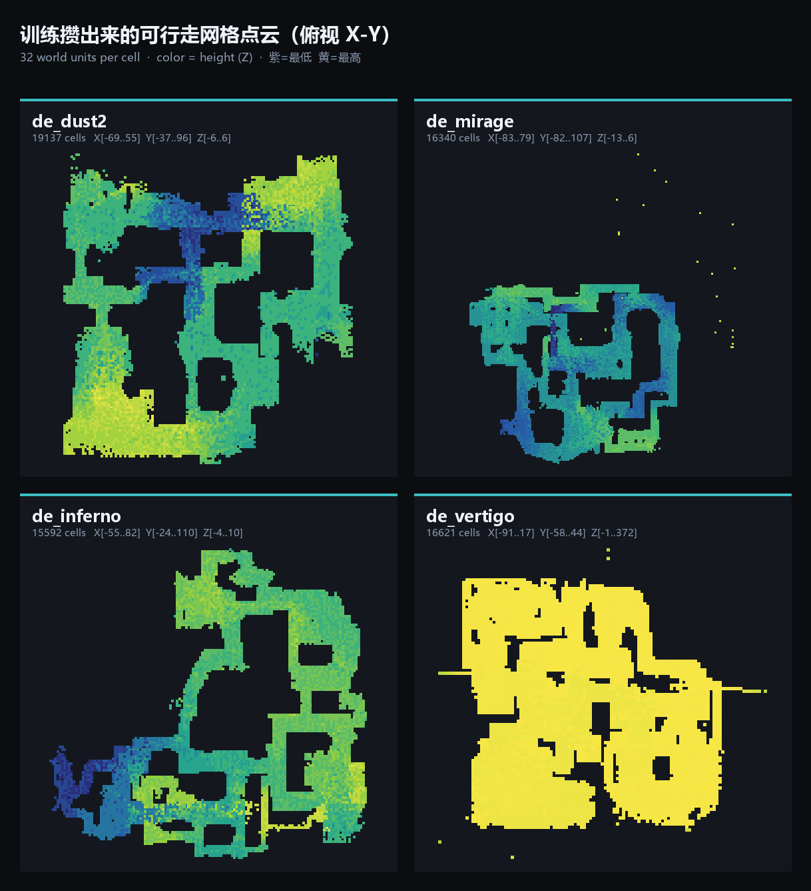
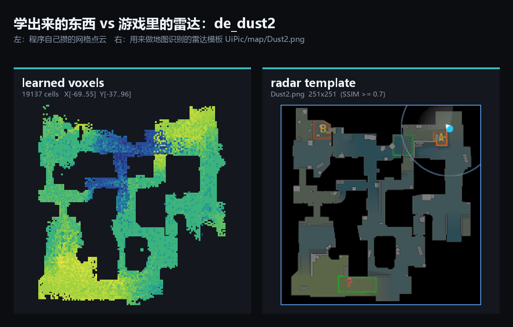
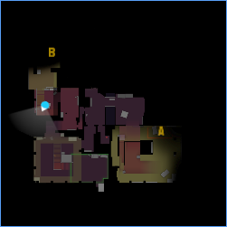
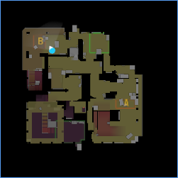
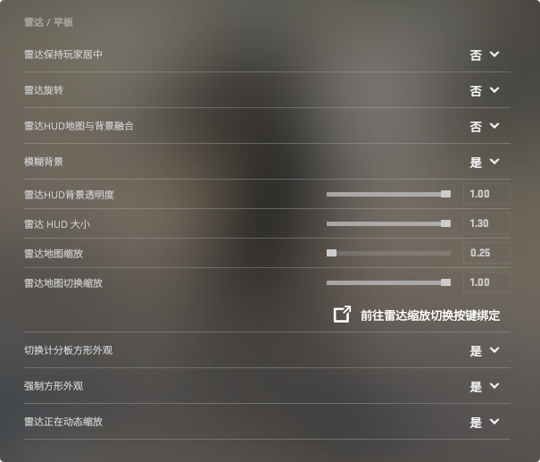

# 用 Python 给 CS2 写自动击杀脚本：读内存当眼睛，自己攒地图当记忆

**Github链接**：[XD-xiao/CSCaseFlow](https://github.com/XD-xiao/CSCaseFlow)

学完 Python 和基本的自动化之后，我一直在想一个问题：如果程序能"看见"游戏里发生了什么，再把手放到键鼠上，它能不能自己打完一局死亡竞赛？

于是有了 CSCaseFlow。它做三件事：**读 CS2 的内存**拿到敌人坐标、血量、朝向；**模拟鼠标键盘**完成瞄准和开火；中间夹着一层我写得最久、也最有意思的逻辑——**自己攒一份地图数据**，用来回答"这个人我现在能不能打到"。

它跑在窗口化模式下的死亡竞赛/人机房里，主要用来挂机刷箱子，或者拿来做自动化测试。写这篇是想把里面几个我觉得挺有意思的技术点记下来，也顺便说说它现在还不够好的地方。

> 免责：这类工具在 VAC 保护的服务器上使用基本等于自杀式封号，只适合在离线或人机环境里研究。代码和思路仅供学习，别拿去破坏别人的对局体验。

## 先说清楚它是什么

程序一共 5 个工作模式，我在 `main.py` 里做成了一个上下键选择的小菜单：

| 模式 | 说明 | 干的事 |
| --- | --- | --- |
| 1 | 击杀模式，不用可视学习 | 随机走路 + 自动击杀，地图只读不写 |
| 2 | 击杀模式，用可视学习 | 同上，但会把"看得见敌人的位置"记进地图 |
| 3 | 训练模式，不自动击杀 | 只采集数据，不动手 |
| 4 | 训练模式，自动击杀 | 一边采集一边打，攒地图最快 |
| 5 | 地图调试 | 只做一次地图识别，打印结果 |

按键 `END` 随时退出，退出前会把地图数据落盘。

## 整体架构：眼睛、脑子、手

代码分成了三层，分界线是我特意划的——**能读内存的地方不碰键鼠，能碰键鼠的地方不做判断**：

| 目录/文件 | 角色 | 干什么 |
| --- | --- | --- |
| `AutoKill/MemoryManager.py` | 眼睛·取数 | 附加进程、读写内存，只负责"把字节读出来" |
| `AutoKill/PawnReader.py` | 眼睛·解读 | 把字节翻译成"敌人血量 87、坐标 xyz、朝哪看" |
| `AutoKill/MapManager.py` | 记忆 | 网格地图的读写、视线判定、持久化 |
| `AutoKill/Uitlity.py` | 手 | `SendInput` 鼠标位移、按键模拟、角度换算 |
| `AutoKill/AutoMain.py` | 脑子 | 多线程调度：读数据、追击、开火、走路、学习 |
| `InterfaceControl/` | 界面 | 截图 + SSIM 识别当前地图、自动选队 |
| `Setting/Setting.py` | 旋钮 | 所有能调的参数都在这里，业务代码里不写魔数 |

下面挑几个我觉得值得说的点。

## 一、偏移量不写死在代码里

CS2 每次大版本更新，`client.dll` 里那些结构体偏移量会整体重排。如果把它们硬编码进代码，游戏一更新程序就废了。

我的做法是把偏移量交给 [a2x/cs2-dumper](https://github.com/a2x/cs2-dumper)：先把它的 `cs2-dumper.exe` 跑一遍，输出的 `offsets.json`（全局偏移）和 `client_dll.json`（各类的字段布局，光 `client.dll` 里就有 528 个类）放到 `Offsets/output/`，程序启动时再去读。

关键是**按字段名找，而不是按数字记**。`client_dll.json` 里每个类都记录了 `parent`，所以要拿到 `m_iHealth` 这种定义在父类 `C_BaseEntity` 上的字段，得沿着继承链往上爬：

```python
def get_field(class_name, field_name):
    class_info = classes.get(class_name)
    field = class_info.get("fields", {}).get(field_name)
    if field is not None:
        return field
    parent = class_info.get("parent")
    if parent:
        return get_field(parent, field_name)   # 自己没有就问爸爸
    raise KeyError(f"'{field_name}' not found in '{class_name}'")
```

好处是：**游戏更新后我只需要重跑一次 dumper**，代码一行都不用改。而且加载完还会校验一遍"有没有哪个字段是 None"，缺了就拒绝启动，而不是带着错误的偏移量跑起来乱读一通内存。

代码里读内存的写法参考了 [Jesewe/cs2-esp](https://github.com/Jesewe/cs2-esp)，用 `pymem` 附加进程、按模块名取 `client.dll` 基址，再往上加偏移。

## 二、实体列表的"两级索引"

CS2 的实体列表不是个简单数组，而是分块的：一个大列表里挂着若干"块"，每块 512 个槽位。想拿第 `i` 个实体，得先算它在哪个块：

```python
list_index   = (i & 0x7FFF) >> 9      # 第几块
entity_index = i & 0x1FF              # 块内第几个

entry_ptr = read_longlong(ent_list + 8 * list_index + 0x10)
controller_ptr = read_longlong(entry_ptr + 112 * entity_index)   # 112 是单条结构大小
```

更绕的是**玩家有两层对象**：`CCSPlayerController`（玩家控制器）和 `C_CSPlayerPawn`（身体）。控制器上的 `m_hPlayerPawn` 不是指针，而是一个**句柄**——低 15 位才是真正的索引，得拿它再走一遍上面那套两级寻址，才能找到 Pawn：

```python
handle = read_int(controller_ptr + m_hPlayerPawn)   # 是句柄，不是指针
pawn_index = handle & 0x7FFF                        # 低 15 位才是索引
# 拿这个索引再走一遍上面那套两级寻址，才拿到 Pawn 的地址
```

这里踩过一个小坑：`m_hPlayerPawn` 是 4 字节的句柄，一开始我用 `read_longlong` 读，多读出来的 4 个字节是好是坏全看运气，偶尔就会寻到一个完全不相干的地址上。

## 三、瞄准点不止一个：骨骼 + 血量

只知道敌人站在哪是不够的——打脚和打头的区别就是能不能一枪解决。CS2 的骨骼位置可以顺着这条链拿到：

```
Pawn → m_pGameSceneNode → (+0x1E0) 骨骼数组 → 第 n 块骨骼（每块 32 字节）
```

拿到骨骼数组之后，我按血量挑了骨骼：

```python
bone_id = 6 if entity.health >= 93 else 4    # 满血打头，残血打胸
entity.pos = self.bone_pos(bone_id, game_scene, entity.pawnPtr)
```

思路很朴素：步枪爆头能一枪带走满血的人，所以满血目标值得瞄头（骨骼 6）；但只要掉了一点血，躯干随便两枪也能收掉，这时候瞄胸（骨骼 4）命中率更高、容错更大。等于是用血量做了一个"收益/风险"的取舍，比不管三七二十一都锁头稳得多。

拿到骨骼坐标后还不能直接用，我做了两处修正：**沿着敌人当前朝向往前推 6 个单位**（相当于给移动中的目标留一点提前量），以及对高度做一次固定补偿（骨骼坐标和我用来当瞄准起点的玩家坐标不在同一个基准上）。这两个数字都是对着我自己的画面设置试出来的，不是什么公式推出来的结果。

## 四、"能不能打"，游戏其实早就告诉你了

这是最省事的一步。每个 Pawn 身上都有一份 `EntitySpottedState_t`：

- `m_bSpotted`：一个布尔值，字面意思是"我被人看见了"；
- `m_bSpottedByMask`：两个 32 位掩码，按实体下标记录"谁看见了它"。

我把**本地玩家自己身上**的这份掩码读出来，把位还原成实体下标集合：

```python
spotted_by_mask = read_uint32s(player.pawnPtr + m_entitySpottedState + m_bSpottedByMask, 2)
# 把两个 32 位整数拆成"第几位是 1"，每一位就是一个实体下标
```

然后判断敌人时直接查这个集合：

```python
entity.spotted = entity.id in player.SpottedByMask
if entity.spotted:
    entity.isCanShot = True     # 掩码命中，直接打
    return True
```

**这份数据是游戏自己算出来的**，比我自己做射线检测、判断遮挡要准得多也快得多，所以它永远排在第一位。只有当掩码里没有这个敌人时，我才退回去查自己攒的地图数据。

需要坦白一点：掩码里"哪一位对应哪个实体下标"这个对应关系，是我拿日志一点点对出来的，不是文档里写的。所以它是这套流程里最脆弱的一环——游戏更新或实体顺序一变就可能对不上（好在失效时会退化成"谁都不敢打"，而不是乱开枪）。

另外提一句，本地玩家身上的 `m_bSpotted` 其实是"**有没有人正看着我**"，本来可以用来做"被人瞄了就撤"的决策，但我现在只把它打进调试日志，还没真正用起来。

同一个 Pawn 上的 `m_bHasMovedSinceSpawn` 倒是用上了：死亡竞赛里刚出生的人有无敌时间，没动过就不开枪，省得浪费弹匣。

## 五、自己攒一份地图：把"能走"和"能打"合成一份数据

这是整个项目里我最满意的一块，也是写这篇最想讲的。

内存里能读到的东西是有限的：敌我坐标、朝向、准星上有没有人、我有没有被看见。**这些都是"现在"的信息**，没法回答"墙后面那个人我打不打得到"。被动地等敌人出现在准星里再开枪，本质上是个人形自瞄机器，而不是一个会找架打的程序。

所以我自己攒地图。做法是把世界坐标量化成 **32 单位一个格子**的三维网格，用一个 `set` 存起来：

```python
def _to_grid(self, pos) -> tuple[int, int, int]:
    return (int(pos['x'] // 32), int(pos['y'] // 32), int(pos['z'] // 32))
```

### 数据从哪来

三种来源，对应三种"我刚才确定看到了点东西"的时刻：

**1. 控制台日志（训练模式）**

CS2 的 `mp_logdetail 3` 会把每一次命中的攻击者和被打者坐标打进日志。我用正则把它捞出来，每一行就得到两个"确实存在、且互相能打到"的点：

```python
r'"(?P<attacker>.+?)<\d+><.*?><(?P<attacker_team>\w+)>" '
r"\[(?P<ax>-?\d+) (?P<ay>-?\d+) (?P<az>-?\d+)\] "
r"attacked "
r'"(?P<victim>.+?)<\d+><.*?><(?P<victim_team>\w+)>" '
r"\[(?P<vx>-?\d+) (?P<vy>-?\d+) (?P<vz>-?\d+)\]"
```

**2. 可视学习**：敌人出现在我的"可见"状态里时，说明我和他之间是通的，于是把这两个点连成一条线记下来。

**3. 行走学习**：我自己走过的地方、以及敌人的当前位置，直接记成"这里能站人"。

### 记的时候不是记一个点，是记一条线

如果只记"我走过哪些格子"，那攒出来的是一堆孤立的脚印，中间的空隙没法判断。所以真正写入时，我用 **3D Bresenham** 把起点和终点之间的所有格子都填上：

```python
def add_walkable_path(self, start_pos, end_pos):
    p1, p2 = self._to_grid(start_pos), self._to_grid(end_pos)
    for p in self._bresenham_3d(*p1, *p2):
        self.data.add(p)
```

这一步是整个设计的核心。它带来一个很妙的副作用：

> **两个人能互相打到，说明这条直线上没有墙。**
> 那么这条直线扫过的所有格子，就都可以当成"空"的。

于是**同一份数据同时变成了两种东西**：它既是"可行走空间"（我走过、敌人站过），又是"视线空间"（两点之间连线扫过的都是空的）。判断能不能开枪，就变成了一次查表：

```python
def can_shoot(self, start_pos, end_pos) -> bool:
    p1, p2 = self._to_grid(start_pos), self._to_grid(end_pos)
    if p1 not in self.data or p2 not in self.data:
        return False                      # 起终点都不认识，不冒险
    return self._check_path(p1, p2)       # 射线上每个格子都得认识

def _check_path(self, p1, p2) -> bool:
    for p in self._iter_bresenham_3d(*p1, *p2):
        if p not in self.data:
            return False                  # 中间碰到不认识的格子 → 大概率是墙
    return True
```

反过来也成立：只要射线上有一个格子没记录过，就说明我从来没在这条线上观测到"通畅"，那多半是堵墙——不开枪，不浪费子弹也不暴露位置。

### 攒出来的东西长什么样

说出来可能有点土，但这些数据就是靠一局一局打出来的。四张图（Dust2 / Mirage / Inferno / Vertigo）跑下来，每张图大概攒了 1.5～1.9 万个格子：



每一格是 32 个游戏单位，颜色代表高度（紫→黄 = 低→高）。Inferno 的高差层次最明显；Vertigo 则有个挺有意思的特征——它的可玩区域整体悬在很高的高度上（格值 357～372，换算过来是一万多个游戏单位），所以整张图看上去一片黄。

把它和我拿来做地图识别的雷达图并排放，轮廓基本能对上：



左边是程序自己一局一局攒出来的，右边是游戏雷达的截图。中路的走向、左右两个半区、高台和出生点的相对位置，都能看出对应关系——看到这张对比图的时候我还是挺高兴的，因为这等于证明"靠坐标喂出来的数据是真的在还原一张地图"。

### 存储和手感

数据用 `pickle` 存成 `mapData/<地图名>.pkl`，写入采用"先写临时文件再 `os.replace`"的方式，避免写到一半崩溃把整份数据写坏；落盘间隔 10 秒，用 `threading.RLock` 保护并发访问。

还有个小心思：**每记录到一个新格子就"嘀"一声**（异步 `winsound.Beep(800, 500)`）。训练模式下不看屏幕，光凭声音密集程度就能知道这局有没有在攒到新东西——比盯着一堆打印日志直观多了。

## 六、瞄准是个闭环，不是一道公式

很多人以为自瞄就是"算出角度差 → 换算成鼠标位移 → 移动一次"。我一开始也这么写，结果是过冲、画圈、来回抖。

因为**角度和鼠标位移之间的换算关系，我永远不可能精确知道**：游戏内灵敏度、`m_yaw`、DPI、鼠标加速、Windows 指针速度都会影响它。与其猜，不如让游戏自己告诉我。

所以 `setAngle` 是个闭环控制器：每一轮都重新读一次**游戏里真实的视角**，只走误差的 20%，然后立刻重新评估。

```python
while True:
    angle = read_vec2(player.pawnPtr + m_angEyeAngles)   # 每轮重新读真实视角
    dx = target_angle["x"] - angle["x"]                  # 垂直误差
    dy = target_angle["y"] - angle["y"]                  # 水平误差
    if abs(dx) < 0.1 and abs(dy) < 0.1:                  # 小于 0.1° 就算到了
        break
    mx = int(dy * -45.72 * 0.2 * sens)                   # 只走 20%，避免过冲
    my = int(dx * 45.71 * 0.2 * sens)
    Utility.move_once(mx, my)
```

这里的 `45.72` 是"灵敏度为 1 时，转 1 度大约需要的鼠标位移量"（对应 CS2 默认 `m_yaw = 0.022`，1 / 0.022 ≈ 45.45，实测微调到 45.72）。但因为它外面套了闭环，**这个常数即使不准也只会影响收敛速度，不会影响最终落点**——这就是闭环相对开环最大的好处，不怕参数不精确。

另外还有几个细节：

- **分步发送**。一次性发 500 个单位的鼠标位移，游戏可能会把整段吞掉，所以 `Utility.move` 会把位移切成每步最多 30 单位，分多次 `SendInput` 发出去；
- **用 `SendInput` 而不是 `pynput` 移动鼠标**。前者可以直接注入相对位移，后者是绝对坐标移动，会和游戏的原始输入打架（`pynput` 我只用来点左键）；
- **归一化角度差**。视角从 179° 转到 -179° 只差 2°，但直接相减是 358°，所以要手动把差值折回 ±180°；
- **有上限**。整个闭环最多跑 0.6 秒或 500 次迭代，避免目标丢失时在里面空转。

### 开枪前，再让游戏确认一次

瞄准到位了就开枪吗？不，我还加了最后一道保险：**读游戏自己的"准星指着谁"**（`m_iIDEntIndex`）。这个值由游戏自己维护，比我算出来的角度可信得多。

```python
for _ in range(5):                       # 给视角同步留一点时间
    if self.reader.update_IsShout(self.player):
        mouse.click(Button.left)
        break
    time.sleep(0.002)
```

也就是说：**我算一个角度 → 移动鼠标 → 问游戏"你现在指着谁" → 确认了才扣扳机**。瞄准是"我的判断"，开火是"游戏的判断"，两者必须一致。不一致就打空枪，代价是浪费一次机会，好处是永远不会对着墙扣扳机。

开火用的是点射（Tap Firing），每枪间隔 0.08 秒。全自动扫射的话，第二发开始枪口就飘了，而我又没有做后坐力补偿——**用点射的节奏换精度，比写一个压枪算法划算得多**。

## 七、线程模型：击杀和走路得抢方向盘

程序里有六个线程，节奏完全不同：

| 线程 | 间隔 | 职责 |
| --- | --- | --- |
| 主循环 | 3 ms | 读本地玩家 + 扫描全部实体，更新共享状态 |
| 击杀线程 | 4 ms | 挑目标 → 瞄 → 确认 → 开枪 |
| 行走线程 | 0.1～2 s 随机 | 随机转视角 / 随机 WASD |
| 可视学习线程 | 0.5 s | 把"看得见的敌人 ↔ 我"连成线记进地图 |
| 行走学习线程 | 0.5 s | 记录自己和敌人的位置 |
| 地图监控线程 | 30 s | 重新识别地图，换图时自动切换地图数据 |

共享数据（实体列表、玩家状态、地图）每个都配了独立的锁。

最要命的一个问题是：**行走线程会按住 W，击杀线程会移动鼠标——两个线程同时在动，谁也打不准**。所以有一个 `is_combat` 标志，击杀线程一发现可打的目标就置位，行走线程在每个检查点都看一眼：

```python
Utility.key_down(key)
start = time.time()
interrupted = False
while time.time() - start < duration:
    if self.is_combat:
        interrupted = True
        break                      # 战斗了，立刻停
    Utility.sleep_with_end(0.05, stop_event=self.stop_event)
Utility.key_up(key)                # 无论如何都要把键松开
```

注意这里按住 W 的时候是**分段等待**的——不能一觉睡 0.6 秒，否则战斗开始了程序还按着 W 在往前冲。中途被打断就立刻松键，松完再歇 0.2 秒，避免操作过密。

另外所有 `time.sleep` 都被我换成了 `sleep_with_end()`，它会把长睡眠切成 50 ms 的小片，每片醒来检查一次退出标志。不然按了 `END` 还得等当前那次睡眠走完才响应。退出时用 `os._exit(0)` 硬退，因为守护线程里可能正按着某个键——**宁可进程粗暴结束，也不能让 W 键卡在按下状态**。

行走线程还顺手干了件杂活：每隔一段随机时间敲一下 `J` 键。我在配置文件里把 `J` 绑成了 `buy ak47; buy m4a1_s; buy m4a1_silencer`，于是**同一个动作既完成了自动买枪，又顺手解决了挂机被踢**——挂机脚本最怕"不动就被踢"，而买枪键反正要按，两件事合并成一个动作很划算。按键前还会先用 `pygetwindow` 确认游戏窗口在前台，免得把 `J` 敲进别人的窗口里。

## 八、地图识别：截图 + SSIM

程序得先知道自己在哪张图上，才能加载对应的地图数据。做法是截取游戏窗口左上角偏移 (13, 36) 处 276×276 的一小块——正好是雷达区域——然后和 `UiPic/map/` 下的模板图逐一比对。

比对用的是 SSIM（结构相似性）：

```python
img2 = cv2.resize(img2, (img1.shape[1], img1.shape[0]))   # 先缩到同尺寸
score, _ = ssim(img1, img2, full=True)                    # -1 ~ 1，越接近 1 越像
```

取分数最高且超过 0.7 的那张模板。两个小设计：

- **一张地图可以有多张模板**。文件名末尾带 `-数字` 后缀的会被识别成同一张图（`Vertigo-1.png` 和 `Vertigo-2.png` 都归到 `Vertigo`）——同一张图多备几份模板，用来吸收出生侧不同带来的雷达差异；
- **地图监控线程每 30 秒重新识别一次**，换图了就把旧地图数据落盘、加载新地图的数据，全程不用重启程序。

| Vertigo-1 模板 | Vertigo-2 模板 |
| --- | --- |
|  |  |

代价是**游戏画面必须固定**：窗口化运行、分辨率固定、雷达设置固定。项目里附了设置参考图：



关键就是关掉"雷达保持玩家居中"和"雷达旋转"，固定雷达大小和缩放——只要雷达不动，截图区域里的内容就稳定，SSIM 才靠得住。这也是模式 5 存在的意义：先单独跑一遍地图识别，确认能认出来再开始挂机。

## 踩过的坑和已知的局限

写项目的时候我给自己记了一笔"哪里还没做好"，因为**把没做的地方写明白，比假装都做了要诚实**：

| 问题 | 现状 |
| --- | --- |
| **没有寻路**。网格数据已经具备"能走/不能走"的信息，但我没写 A*，行走线程现在就是随机 WASD + 随机转视角 | 这是下一步最想补的：有了地图数据，寻路其实是水到渠成的事 |
| **Bresenham 连线会穿墙画格子**。如果两个记录点分处不同楼层或隔着一堵墙，中间那条直线会把"穿过墙体"的格子也标成可通行 | 我在 Vertigo 的数据里就能看到这个痕迹：主平面之外，z 从 285 到 356 每层只散着 1～4 个格子，那就是连线穿出来的假数据 |
| **掩码下标是试出来的**。`m_bSpottedByMask` 的位和实体下标之间的对应关系靠实测定下来，游戏更新后需要重新校准 | 一旦对不上，会退化成"都不敢打"，相对安全 |
| **一组魔数**。骨骼数组偏移 `0x1E0`、瞄准点高度补偿、`45.72` 这个换算系数，都是按我自己这套画面/灵敏度手调的 | 换了分辨率或灵敏度要重调，已在 `Setting.py` 里集中管理 |
| **抗检测基本为零**。`pymem` 直接读写进程内存，行为模式也很机械（虽然随机化了走路和视角） | 所以我只在离线/人机环境里跑，从不在匹配里用 |
| **对局中断处理粗糙**。实体列表读空就直接退出程序 | 简单粗暴，但至少不会带着错误状态乱开枪 |

## 几句实话

- 这个项目的**大部分代码是我用 AI 辅助写的**，我负责设计思路、定参数、踩坑和验证；
- 内存读取那部分的写法参考了 [Jesewe/cs2-esp](https://github.com/Jesewe/cs2-esp)，偏移量数据来自 [a2x/cs2-dumper](https://github.com/a2x/cs2-dumper)，在此致谢；
- **这东西在 VAC 保护的服务器上用几乎必然封号**，写它的目的是研究内存结构、坐标系统和自动化控制，不是拿去打排位。

## 最后

回头看，这个项目真正让我学到的其实不是"怎么读游戏内存"——那部分跟着参考项目抄一遍就会了。难的是后面那些**没有标准答案的部分**：

- 内存只给我"现在"，我怎么攒出"地图"？（把观测结果量化成网格、把两点连线当成"这里没墙"）
- 参数永远算不准，怎么办？（那就别算准，用闭环让游戏自己纠正）
- 两个线程要抢同一个方向盘，怎么协调？（用一个状态标志加分段等待，谁该让路谁让路）

这些问题在教程里都搜不到，只能自己一边试一边改。等第一版能自己走、自己找目标、自己开枪的时候，那种感觉比写完任何一个 CRUD 都爽。

如果你也在折腾类似的东西，或者对"用观测数据反推空间结构"这件事有更好的做法，很想听听你怎么做。
