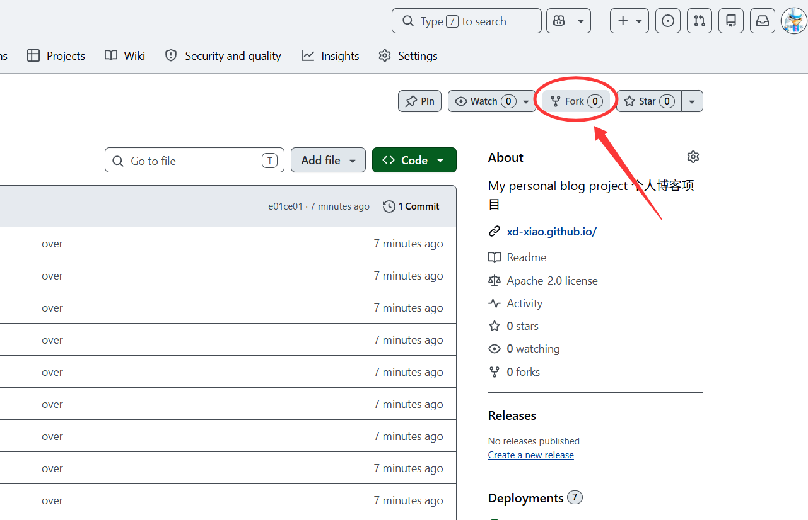
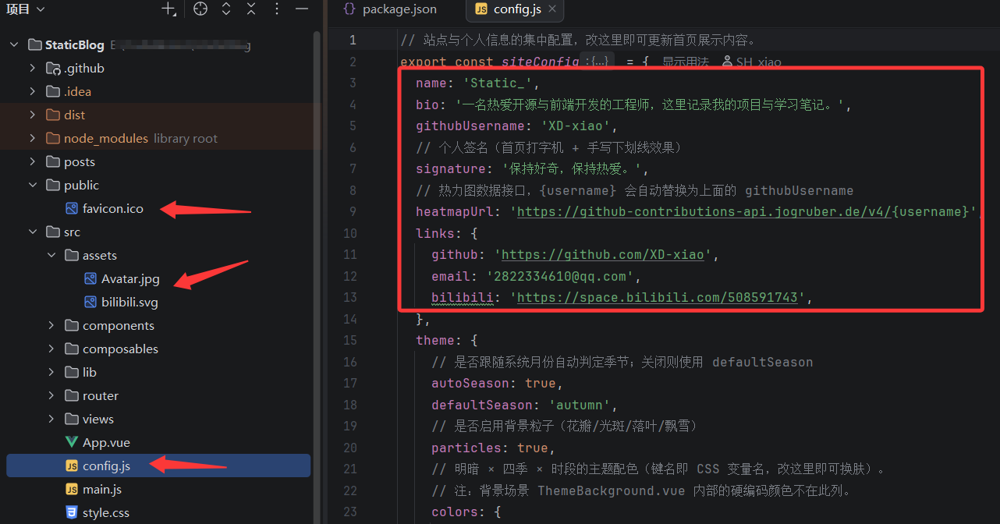
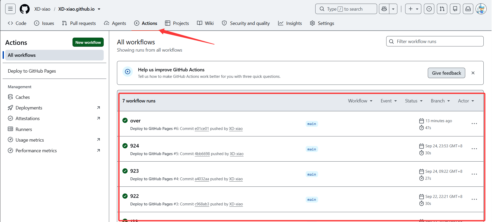

# Static博客使用说明书

你好，欢迎来到我的博客。

这个网站，是我使用vibe coding做出来的。它没有复杂的后台，写文章用的是 Markdown；页面的颜色会跟着季节和一天里的时间悄悄变化——春天有花瓣，冬天有飘雪，到了夜里会换成一片星空。它跑在 GitHub Pages 上，免费，也不用备案。

写这篇，是想记录下这个博客的由来，也想把它分享给同样想拥有一块自己空间的朋友。如果你也想要这样一个博客，下面这份「照着做就能上线」的步骤，应该能帮你省下不少折腾。


## 几个我比较喜欢的地方

- **写作很轻*轻松：文章就是普通的 Markdown 文本文件，放到指定文件夹就自动出现在博客里，不需要任何后台系统。
- **免费托管**：部署在 GitHub Pages 上，GitHub 免费提供空间和域名，不用为服务器花钱。
- **改一处就变自己的**：名字、简介、签名、GitHub、邮箱、B 站链接都集中在一个配置文件里，改完即生效。
- **随季节昼夜换肤**：春天有花瓣、冬天有飘雪，白天明亮、夜晚静谧，页面会自己「呼吸」。
- **展示 GitHub 贡献热力图**：把写代码的活跃度直接放在首页。
- **改完自动上线**：只要把改动推送到 GitHub，网站就会自动重新构建并更新，不用手动操作。


## 上手前，你需要准备

- 一个 [GitHub](https://github.com) 账号（注册免费，几分钟即可）。
- 一台能上网的电脑。

就这么简单。如果你愿意在网页上操作，连本地开发环境都不用装；如果你喜欢在本地改代码再预览，可以额外装一个 Node.js（见文末「进阶：本地开发」）。

## 第一步：Fork（复制）这个项目

「Fork」是 GitHub 的一个功能，意思是把别人的项目完整复制一份到你自己的账号下，之后你就可以随意改它了。

1. 打开本项目在 GitHub 上的仓库页面。
2. 点击右上角的 **Fork** 按钮。
3. 在弹窗里直接点 **Create fork**，几秒后你就拥有了一份属于你自己的副本。





> 小提示：Fork 出来的仓库默认名还是原来的名字。如果你希望博客地址是 `https://你的用户名.github.io/` 这种干净形式，可以稍后把仓库改名为 `你的用户名.github.io`（改法见文末「常见问题」）。

## 第二步：把信息改成你自己的

这一步是核心，改完博客就真正变成「你的」了。

### 2.1 改基本信息

打开仓库里的 `src/config.js` 文件（点击文件名即可在网页上直接编辑），里面就是所有个人信息。重点改这几个：

| 字段 | 含义 | 例子 |
| --- | --- | --- |
| `name` | 首页展示的名字 | `Static_` |
| `bio` | 一句话个人简介 | `一名热爱开源与前端开发的工程师` |
| `signature` | 首页的签名（打字机效果） | `保持好奇，保持热爱。` |
| `githubUsername` | 你的 GitHub 用户名，用于热力图 | `XD-xiao` |
| `links.github` | 你的 GitHub 主页链接 | `https://github.com/你的用户名` |
| `links.email` | 你的邮箱（首页点击可复制） | `你的邮箱` |
| `links.bilibili` | 你的 B 站主页链接 | `https://space.bilibili.com/你的ID` |

`heatmapUrl` 一般不用动，它已经会自动把你填的 `githubUsername` 填进去。

### 2.2 改浏览器标题

打开仓库根目录的 `index.html`，把 `<title>` 标签里的文字（目前是「XD-xiao · 个人博客」）改成你的，比如「你的名字 · 个人博客」。建议和上面的 `name` 保持一致。

### 2.3 换头像和站点图标

- 首页头像：替换 `src/assets/Avatar.jpg`。在网页上打开这个文件，点右上角的「删除」再「上传」即可换图，或用编辑器的「上传文件」功能覆盖。
- 站点小图标（浏览器标签页上的图标）：替换 `public/favicon.ico`，同样是上传覆盖。





## 第三步：写下你的第一篇文章

所有文章都放在 `src/assets/posts/` 文件夹里，一个 `.md` 文件就是一篇博客。

在 GitHub 网页上进入 `src/assets/posts/` 文件夹，点 **Add file → Create new file**，把文件名写成 `my-first-post.md`（注意 `.md` 后缀），然后粘贴下面的内容：

```markdown
---
title: 我的第一篇文章
date: 2026-09-25
description: 这是一篇示例文章。
tags: [随笔]
---

# 你好，世界

这是我的第一篇文章，欢迎来到我的博客！

## 关于我

- 喜欢折腾各种新工具
- 正在学习前端开发
```

最上面用 `---` 包起来的几行叫「元信息」，含义如下：

- `title`：文章标题。
- `date`：发布日期，用来排序，格式 `年-月-日`。
- `description`：一句话简介，会显示在文章卡片上。
- `tags`：标签，用方括号和中英文逗号分隔。只要在标签里写上 `置顶`，这篇文章就会排在列表最前面。

正文用 Markdown 写即可：`#` 是标题，`-` 是列表，`**加粗**`，`[链接](地址)` 是超链接。

文章里要放图片时，把图片上传到 `src/assets/img/` 文件夹（建议每篇文章建一个同名子文件夹），然后在文中用相对路径 `../img/...` 引用，例如：

```markdown

```

## 第四步：开启自动部署，让博客上线

改好了内容，接下来要让 GitHub 自动把网站发布到公网。

### 4.1 先启用 Actions（关键一步）

Fork 出来的仓库，GitHub 默认是「禁用自动任务」的。请打开你的仓库页，点顶部的 **Actions** 标签，如果看到一个绿色按钮写着 **I understand my workflows, go ahead and enable them**，点它启用。


### 4.2 触发第一次部署

回到代码页，随便做一个很小的改动并提交（例如改一下 `bio` 里的一句话，或者新增一篇文章），GitHub 检测到推送就会自动开始构建和部署。

提交后，打开 **Actions** 标签，能看到一条名为 **Deploy to GitHub Pages** 的任务在跑，跑完显示绿色对勾即部署成功。

### 4.3 查看你的网站地址

部署完成后，地址可以在 **Settings → Pages** 页面顶部看到（形如 `https://你的用户名.github.io/仓库名/`），或者在 **Actions** 里那次成功运行的 `deploy` 步骤详情里查看。




把这个地址复制到浏览器打开，就是你的个人博客了。

## 第五步：以后怎么更新

很简单：**改了文件 → 提交 → 自动更新**。

- 想发新文章：在 `src/assets/posts/` 里新建 `.md` 文件并提交。
- 想改个人介绍：改 `src/config.js` 提交。
- 想换头像：上传新图片覆盖提交。

每次提交，GitHub 都会自动重新构建并更新你的网站，几分钟内生效，无需任何手动操作。

如果你改了文件但没看到自动任务，也可以手动触发：打开 **Actions** 标签 → 选 **Deploy to GitHub Pages** → 点 **Run workflow** 按钮。

## 常见问题（FAQ）

**Q：我的网站地址到底是什么？**

取决于你的仓库名：

- 如果仓库叫 `你的用户名.github.io`，地址就是 `https://你的用户名.github.io/`。
- 如果仓库是其他名字（比如 fork 后的原名），地址是 `https://你的用户名.github.io/仓库名/`。

这个博客已经做了「自动适配」，无论哪种情况都不用改代码。想让地址干净点，就把仓库改名为 `你的用户名.github.io`：进 Settings 页面顶部的 **Rename** 即可（注意改名后旧地址会失效）。

**Q：我改了文件，但网站没变化？**

多半是 Actions 没启用或 Pages 的 Source 没选对。回到本文「第四步」确认两步都做了。另外部署需要几分钟，稍等再刷新（可以按 `Ctrl + F5` 强制刷新，避免浏览器缓存）。

**Q：首页的 GitHub 热力图不显示？**

热力图用的是第三方接口，偶尔会因网络或接口不稳定而空白。先确认 `githubUsername` 填对了（是你的 GitHub 用户名，不是昵称）。如果仍不显示，通常是接口暂时不可用，过段时间再试即可。

**Q：需要买服务器、买域名、备案吗？**

都不用。GitHub Pages 免费提供空间和 `github.io` 域名。若你以后想绑定自己的域名，也可以额外配置，但这不是必须的。

**Q：我不是程序员，Markdown 是什么？**

Markdown 是一种「用简单符号排版」的纯文本写法，比 Word 轻量、比纯文本好看。上面第三步已经给了最常用的几个符号，照着写就行，几篇下来就熟了。

## 进阶：本地开发（可选）

如果你更喜欢在本地电脑上改代码、实时预览效果，可以这样做：

1. 安装 [Node.js](https://nodejs.org)（版本需 `22.18.0` 或更高，见 `package.json` 的 `engines`）。
2. 用 `git clone` 把仓库下载到本地。
3. 在项目目录执行：

```bash
npm install   # 安装依赖
npm run dev   # 启动本地预览，浏览器打开 http://localhost:5173
```

本地编辑 `src/assets/posts/` 下的文件，页面会自动刷新。确认没问题后 `git push` 上去，网站就会自动更新。

> 对大多数只想「有个自己的博客」的朋友来说，第四步的网页操作已经足够，本地开发不是必选项。

---

如果你照着做下来了，欢迎也把它分享给更多人。写作愉快，我们下一篇见。
